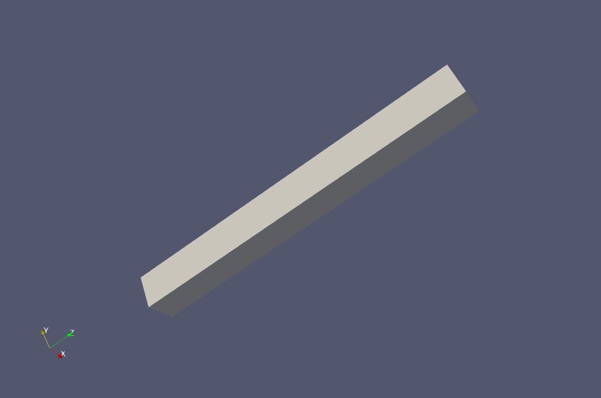

==================================================
Cauchy THM couplings: Thermoelasticity application
==================================================

In this tutorial we will validate the complex behavior of our model in elasticity in the presence of THM couplings.
Our model is a rectangular cantilever of unit base dimensions and of length 10 mm.
The base of the cantilever is connected to the ground by a pin (displacement constraint in all dimensions) on the bottom 
lower left vertex and two rollers (displacement contraints along the vertical and the respective vertices of the rectangular base) 
on the bottom lower right corner and the bottom upper left corner. Thus, during heating, the base of the cantilever is free to expand,
without inducing stresses to the cantilever.

The file for this tutorial can be found in: 
:py:mod:`ngeoFE_unittests.Multiphysics.Cauchy_tests.ThreeD.BVP.CAUCHY_TM_Thermoelasticity_0`
  
  
| The boundaries of the cube are considered to be insulated from its surroundings meaning that no flow of heat is allowed to take place. Under this configuration, the flow of heat insde the cantilever is reminiscent of the 1D heat flow along a rod. We will be checking the diffusion time, 
the temperature evolution at the free end of the cantilever and the developed displacements at the end of the analysis, when steady state has been achieved. 
 
Begining of file
================

The file begins as follows:

.. code-block:: python
   :emphasize-lines: 1,4,5,6,7
   
   from dolfin import *
   from ngeoFE.feproblem import UserFEproblem, General_FEproblem_properties
   from ngeoFE.fedefinitions import FEformulation
   from ngeoFE.materials import UserMaterial
   from ngeoFE_unittests import ngeo_parameters
   from ngeoFE_unittests import plotting_params 
   import os # allows for easier handling of paths
   from _operator import itemgetter # allows for transformation of lists to iterables, usefull for the definition of boundary conditions

Finite element formulation
==========================

For the implementation of the problem at hand the extra unknowns of the pressure and temperature fields need to be taken into account.
We also need to include the values of pressure and temperature inside the material description so that the correct total and effective stresses are 
taken into account. Moreover, the existence of the coupled momentum, energy and mass balance partial differential equations 
(see :ref:`previous tutorial<Tutorial_Cauchy_THM_theory>`), implies that the variational form of the problem needs to be modified in
order to include the transient and coupling terms in the solution of the finite element problem. This procedure has been described in greater detail in 
the :ref:`THM couplings implementation tutorial<Tutorial_Cauchy_THM_implementation>`. The new Finite Element formulation is given as follows:

.. code-block:: python

   class THM3D_FEformulation(FEformulation):
       '''
       Defines a user FE formulation
       '''
       def __init__(self):
           # Number of stress/deformation components
           self.p_nstr=6+3+3
           # Number of Gauss points
           self.ns=1
           # Number of auxiliary quantities at Gauss points
           self.p_aux=2
        
       def auxiliary_fields(self,v):
           '''
           Set user's generalized deformation vector
           '''
           auxgde=[
           v[3],
           v[4],
               ]
           return as_vector(auxgde)
         
       def generalized_epsilon(self,v):
           '''
           Set user's generalized deformation vector
           '''
           gde=[
               Dx(v[0],0),              #gamma_11
               Dx(v[1],1),              #gamma_22
               Dx(v[2],2),              #gamma_22
               Dx(v[1],2)+Dx(v[2],1),   #gamma_23
               Dx(v[0],2)+Dx(v[2],0),   #gamma_13
               Dx(v[0],1)+Dx(v[1],0),   #gamma_12
               Dx(v[3],0),  #q_1 - pf
               Dx(v[3],1),  #q_2 - pf
               Dx(v[3],2),  #q_3 - pf
               Dx(v[4],0),  #q_1 - temp
               Dx(v[4],1),  #q_2 - temp
               Dx(v[4],2),  #q_3 - temp
               ]
           return as_vector(gde)
 
        def create_element(self,cell):
           """
           Set desired element
           """
           self.degree=1
           # Defines a Lagrangian FE of degree 1 for the displacements
           element=VectorElement("Lagrange",cell,degree=self.degree,dim=3+1+1)
   
           return element 
         
       def dotv_coeffs(self):
           """   
           Set left hand side derivative coefficients
           """
           return as_vector([0.,0.,0.,1.,1.])

       def setVarFormAdditionalTerms_Res(self,u,Du,v,svars,metadata,dt):
           Res=0.
           lstar=svars.sub(55-1)
           bstar=svars.sub(56-1)
           rhoC=svars.sub(57-1)
           #HM terms
           eps=self.generalized_epsilon(Du)
           eps_v=eps[0]+eps[1]+eps[2]
           virtual_pf=v[3]
           
           Res+=-(1./bstar)*(1./dt)*dot(eps_v,virtual_pf)*dx(metadata=metadata) 
           
           #TM terms
           virtual_Temp=v[4]
           for i in range(1,6):
               Res+= + (1./rhoC)*(1./dt)*svars.sub(1+i-1)*svars.sub(41+i-1)*virtual_Temp*dx(metadata=metadata)
             
           #HT terms
           DTemp=Du[4]
           Res+= +(lstar/bstar)*(1./dt)*dot(DTemp,virtual_pf)*dx(metadata=metadata)
           
           return Res

       def setVarFormAdditionalTerms_Jac(self,u,Du,v,svars,metadata,dt,ddsdde):
           lstar=svars.sub(55-1)
           bstar=svars.sub(56-1)
           rhoC=svars.sub(57-1)
           alfa=svars.sub(58-1)
           Jac=0.
           #HM terms
           eps=self.generalized_epsilon(u) #needs u (trial function, because it takes derivatives in terms of u and not Du for calculating the Jacobian.
           eps_vol=eps[0]+eps[1]+eps[2]
           virtual_pf=v[3]
           Jac+=+(1./dt)*(1./bstar)*dot(eps_vol,virtual_pf)*dx(metadata=metadata)
    
           #MH terms
           pf=u[3] #same as before
           virtual_eps=self.generalized_epsilon(v)
           virtual_eps_vol=virtual_eps[0]+virtual_eps[1]+virtual_eps[2]
           Jac+=-(1./dt)*dt*dot(pf,virtual_eps_vol)*dx(metadata=metadata)
            
           #HT terms
           temperature = u[4]
           Jac+=-(1./dt)*(lstar/bstar)*dot(temperature,virtual_pf)*dx(metadata=metadata)
           
           #MT terms due to thermal expansion
           eps_temp=alfa*temperature*as_vector([1.,1.,1.,0.,0.,0.,0.,0.,0.,0.,0.,0.])
           Jac+=-(1./dt)*dt*inner(dot(ddsdde,eps_temp),virtual_eps)*dx(metadata=metadata) 
           
           #TM terms due to thermal dissipation
           virtual_temp=v[4]
           eps_plastic=[]
           for i in range(0,self.p_nstr):
               eps_plastic.append(svars.sub(41-1+i))
           eps_plastic=as_vector(eps_plastic)
           Jac+=-(1./dt)*(1./rhoC)*inner(dot(ddsdde,eps),eps_plastic)*virtual_temp*dx(metadata=metadata)

           #TM terms due to thermal expansion
           Jac+=-(1./dt)*(1./rhoC)*inner(dot(ddsdde,eps_temp),eps_plastic)*virtual_temp*dx(metadata=metadata)         
           return Jac

Finite element problem description
==================================

We proceed now with building the main Finite element model, corresponding to a 3D Cauchy elastic cantilever heated at its base.
The finite element model is built inside a child class that inherits its methods from the parentclass UserFEproblem(). 
We will provide here commentary for each method used inside the childclass THM3D_FEproblem(UserFEproblem).

.. _THM3D FEproblem:

.. code-block:: python
   
   class THM3D_FEproblem(UserFEproblem):
       def __init__(self,FEformulation):
           self.description="Example of 1D plane strain problem, Cauchy continuum"
           self.problem_step=0.
           self.h = 10.
           self.l = 1.
           self.w = 1.
           super().__init__(FEformulation)
        
In the class :py:meth:`__init__()` method, the finite element formulation defined above is provided as argument.The geometric dimensions of the problem are also specified
Its height self.h=1.0, its length self.l=1.0 and its width self.w=1.0 . The initialization then proceeds to set up all the methods of the parentclass :py:class:`UserFEproblem()<ngeoFE.feproblem.UserFEproblem>`. 
The methods inside the class are defined by overriding the methods inside the parent class. 

.. code-block:: python

    def set_general_properties(self):
        """
        Set here all the parameters of the problem, except material properties 
        """
        self.genprops=General_FEproblem_properties()
        # Number of state variables
        self.genprops.p_nsvars=62

This method is used to provide the number of state variables of the material. In this tutorial only the mechanical behavior is important 
and therefore, the state of material is described by the increment of stress, total strain, elastic strain, plastic strain, plastic strain multiplier
and plastic strain rate. Notice that even though the problem is in 3D and three strain components (and consequently  three stress components) are needed for the description of equilibrium
the state of the material contains the information also for the rest components of the general 3D problem. For each material used by the Numerical Geolab, the number of state variable
components is given in the corresponding :ref:`material table<material description of state variables>`.

Next we continue by generating the mesh for the problem at hand. Here, we model a 3D Cauchy rectangular cantilever.
For this simple geometry the capabilities of the :py:mod:`dolfin.cpp.mesh` module can be used to define 
a cube consisting of 4 tetrahedral elements by specifying the bottom left and upper right corners of the cubic domain.

.. code-block:: python

    def create_mesh(self):
        """
        Set mesh and subdomains
        """
        self.nx=1
        self.ny=1
        self.nz=100
        mesh=BoxMesh(Point(-0.5*self.l,-0.5*self.w,-0.5*self.h),Point(0.5*self.l,0.5*self.w,0.5*self.h),self.nx,self.ny,self.nz)
      
        cd = MeshFunction("size_t", mesh, mesh.topology().dim())
        fd = MeshFunction("size_t", mesh, mesh.topology().dim()-1)
        return mesh, cd, fd

For the domain at hand we specify a discretization with nx=1 element along the x[0] component, ny=1 element along the x[1] 
component and nz=1 element along the x[2] component. The :py:class:`dolfin.cpp.mesh.MeshFunction` method of dolfin is used to 
provide the mesh object, the interior domain and the boundary domains. The following model is the produced:

         
         Image of the :py:class:`cantilever <dolfin.cpp.generation.BoxMesh>`. The domain was exported with the help of the third party software Paravew.

We next assign values to the regions of the mesh defined by different material properties. 

.. _create_subdomains():

.. code-block:: python
    
    def create_subdomains(self,mesh):
        """
        Create subdomains by marking regions
        """
        subdomains = MeshFunction("size_t", mesh, mesh.topology().dim())
        subdomains.set_all(0) #assigns material/props number 0 everywhere
        return subdomains 
        
In this tutorial all the domain is defined by the same material properties and therfore the value 0 will be assigned everywhere inside the mesh.
This value is a number indicating which material parameters need to be taken into account in each mesh region (see the corresponding method `set_material_params()`_).

Boundary identification
-----------------------

We proceed now by identifying the boundaries needed for the application of the boundary conditions at a later stage of the modeling procedure.
We make use of the :py:class:`dolfin.cpp.mesh.SubDomain` parent class inside dolfin:

.. py:class:: dolfin.cpp.mesh.SuDomain

We create a child class that will handle the assignment of different labels at the different faces of the unit cube. We implement this by 
modifying the :py:meth:`dolfin.cpp.mesh.SubDomain.inside()` method of the parent class.

.. py:method:: dolfin.cpp.mesh.SuDomain.inside()

.. code-block:: python

   class Boundary(SubDomain):
      def __init__(self,xyz,param):
         self.xyz=xyz
         self.param=param
         super().__init__()
      def inside(self, x, on_boundary):
         tol = DOLFIN_EPS
         return on_boundary and near(x[self.xyz],self.param)    

Inside the :py:class:`Boundary subclass<ngeoFE_unittests.Multiphysics.Cauchy_tests.ThreeD.BVP.CAUCHY_THM_ThermoHydroplasticity_1>` we define the logical test for assigning the specific boundary node in one of the boundary regions, where the boundary conditions will be applied.
The value x[i] indicates the spatial coordinate :math:`x_i` of the problem at hand.

In order to not induce additional stresses during heating of the cantilever's base we need to apply an isostatic contraint on it. This 
is only possible if we select separately the boundary vertices to apply the roller and pin constraints respectively. We introcuce the 
:py:class:`Cornerpoint subclass <ngeoFE_unittests.Multiphysics.Cauchy_tests.ThreeD.BVP.CAUCHY_THM_Thermoelasticity_0.Cornerpoint>`  for selecting the boundary vertices.

.. code-block:: python
    
   class Cornerpoint(SubDomain):
      def __init__(self,*argz):
         self.xyz=[]
         self.param=[]
         for arg in argz:
             self.xyz.append(arg[0])
             self.param.append(arg[1])
         #print('hellooo!!!!',self.xyz[0],self.param[0])
         super().__init__()
      def inside(self, x, on_boundary):
         tol = DOLFIN_EPS
         return near(x[self.xyz[0]],self.param[0],tol) and near(x[self.xyz][1],self.param[1],tol) and near(x[self.xyz[2]],self.param[2],tol)

The selection of the boundary vertex is done by specifying its coordinates in the 3D domain.
       
We continue by marking the boundaries of the model based on the classes defined during the boundary identification phase (see section :ref:`Boundary identification` above).
We do so by assigning the numbers 1 to 6 to the different boundary facets of the model. To do this we use the method :py:meth:`mark()<dolfin.cpp.mesh.SubDomain.mark()>` from the :py:class:`SubDomain<dolfin.cpp.mesh.SubDomain>` class of  
:xref:`dolfin`.

.. code-block:: python

    def mark_boundaries(self, boundaries):
        """
        Mark left and right boundary points
        """

        top0 = self.Boundary(2,self.h3/2.)
        top0.mark(boundaries, 1)
        bottom0 = self.Boundary(2,-self.h3/2.)
        bottom0.mark(boundaries, 2)
        #
        left0 = self.Boundary(0,-self.h1/2.)
        left0.mark(boundaries, 3)
        right0 = self.Boundary(0,self.h1/2.)
        right0.mark(boundaries, 4)
        #         
        back0 = self.Boundary(1,-self.h2/2.)
        back0.mark(boundaries, 5)
        front0 = self.Boundary(1,self.h2/2.)
        front0.mark(boundaries, 6)
        
        corner_point1 = self.Cornerpoint([2,-self.h3/2.],[0,-self.h1/2.],[1,-self.h2/2.])
        corner_point1.mark(boundaries, 7)
        
        corner_point2 = self.Cornerpoint([2,-self.h3/2.],[0,self.h1/2.],[1,self.h2/2.])
        corner_point2.mark(boundaries, 8)
        
        corner_point3 = self.Cornerpoint([2,-self.h3/2.],[0,self.h1/2.],[1,-self.h2/2.])
        corner_point3.mark(boundaries, 9)

Thus, we marked the facets constituting the boundary of the cantilever and its bottom vertices, for applying the desired boundary conditions.   

Assigning boundary conditions
.............................

We are now able to identify the boundaries of the mesh and assign different boundary condition to each side of the boundary. 
The way we apply the boundary conditions can be seen in the method `set_bcs()`_: 

.. _set_bcs():

.. code-block:: python

    def set_bcs(self):
        """
        Set boundary conditions for the user problem / could be replaced by external mesher, e.g. Abaqus, Gmsh...
        """
        Temp=10. #Applied temperature during heating of the cantilever base
        bcs = [               
                #top free surface
                [1, [1, [4], 0.]], #the temperature flow vector is free
                
                #bottom
                [2, [2, [4], Temp]], # An initial tmperature increase is applied at the cantilever base instantaneously    
                [2, [0, [3], 0.]],

                #bottom down-left node is pin
                [[7,[-self.h1/2.,-self.h2/2.,-self.h3/2.]], [0, [0], 0.]], 
                [[7,[-self.h1/2.,-self.h2/2.,-self.h3/2.]], [0, [1], 0.]],
                [[7,[-self.h1/2.,-self.h2/2.,-self.h3/2.]], [0, [2], 0.]],    

                #bottom down-right node is roller
                [[8,[self.h1/2.,-self.h2/2.,-self.h3/2.]], [0, [1], 0.]],
                [[8,[self.h1/2.,-self.h2/2.,-self.h3/2.]], [0, [2], 0.]],
                #bottom up-right node is roller
                [[9,[self.h1/2.,self.h2/2.,-self.h3/2.]], [0, [2], 0.]],
                #bottom up-left node is roller
                [[10,[-self.h1/2.,self.h2/2.,-self.h3/2.]], [0, [0], 0.]],
                [[10,[-self.h1/2.,self.h2/2.,-self.h3/2.]], [0, [2], 0.]],    

            ]        

       return bcs   
         
Inside this method the boundaries are assigned with the use of a nested list. Dirichlet, Neuman and Robin boundary conditions can be applied 
both incrementaly and instantaneously. The boundary conditions can be assigned to a boundary region or pointwise. 

| The nested list contains the following information:

| [region id, [type of bc, vector component ,value]]

In this example, the region id ranges from 1 to 10. The value 1 indicate the top facet of the rectangular cantilever which is completely free. The value 2 indicated the bottom
facet of the cantilever, where we apply a uniform temperature increase. We specify also that the pressure increase is zero. The values 7,8,9,10 correspond to the vertices 
of the cantilever base where the displacement constraints are applied. For the displacement components of the vectorspace ([0],[1],[2]), the type of bc is set to 0, 
specifying incremental Dirichlet boundary conditions. For the pore fluid pressure component of the vectorspace ([3]) we specify the value 0 for the type of the boundary condition
indicating an incremental Dirichlet boundary condition of value 0. For the temperature component of the vectorspace ([4]) the type of boundary condition is set to 2 indicating 
an instantaneous Dirichlet boundary condition -here we set a temperature increase of 10 :math:`^oC`. 

History output specification
----------------------------

Numerical Geolab offers the user the capability of extracting the output at the converged increments of the numerical analysis at specific Gauss points 
and nodes of the numerical model. This capability is given to the user in order to obtain the exact nodal output of the solution (forces, displacements)
and the corresponding state variables output at the Gauss points, instead of using the interpolated results provided in a separate .vtk file 
for postprocessing with a third party software (e.g. Paraview).

Assigning the nodal history output
..................................

The history output at the nodes can be given by:

.. code-block:: python

    def history_output(self):
        """
        Used to get output of residual at selected node 
        """
        hist=[[1,[1,[0]]],
              [1,[0,[0]]],
              [1,[1,[1]]],
              [1,[0,[1]]],
              [1,[1,[2]]],
              [1,[0,[2]]],
              [1,[1,[3]]],
              [1,[0,[3]]],
              [1,[1,[4]]],
              [1,[0,[4]]]
              ]
        return hist
        
The node specification works the same way as in set_bcs(). In this example we choose the top facet of the boundary (1) in order to monitor the
all the vector components ([0],[1],[2],[3],[4]) of the force (1) and displacements (0) fields.

Material specification
----------------------

Next, we define the analysis material that we have already assigned in the `create_subdomains()`_ method.

.. code-block:: python

    def set_materials(self):
        """
        Create material objects and set material parameters
        """
        mats=[]
        # load material #1
        
        env_lib=ngeo_parameters.env_lib 
        umat_lib_path= ngeo_parameters.umat_lib_path
        umat_lib = umat_lib_path+'/CAUCHY3D-DP/libplast_Cauchy3D-DP-PR-TEMP.so'
        umat_id=3       # if many materials exist in the same library
        mat=UserMaterial(env_lib,umat_lib,umat_id)
        mat.props=self.set_material_1_properties(2000.,0.,100.,0.,1.)
        #
        mats.append(mat)
        return mats

The ngeo_parameters.py module contains the relative path to the materials libraries, which specify the different materials available to the user.
The variable umat_id=3 needs to be set for the 3D analyses performed here. It specifies the mapping of the updated vector components of the 
strain increment :math:`(\gamma_{11},\gamma_{22},\gamma_{33},\gamma_{23},\gamma_{13},\gamma_{12})` and the corresponding tensor components of the constitutive matrix, 
with their position in the 3D strain vector and 3D constitutive matrix provided at the material subroutine (material algorithm). This mapping returns back the 
correct components of the stress vector and constitutive matrix to pass into the residual calculation of the weak form in dolfin (equilibrium iterations). 
The material properties passed into the material algorithm, are set with the helper method:

.. code-block:: python
    
    def set_material_1_properties(self):
        """
        Sets material parameters
        """
        EE=2000.;nu=0. ;cc=10000000. ;tanfi=0.;tanpsi=0.;Hsfi=0.;Hscc=0. #elastic behavior is ensured
        GG=EE/(2.*(1.+nu))
        KK=EE*GG/(3.*(3.*GG-EE))
        chi=1.0      #permeability;
        eta_f=1.0    #fluid_viscosity
        lstar=0. #thermal expansivity of mixture 
        bstar=10.**8 #hydraulic expansivity of mixture
        alpha=1.     #thermal expansion coefficient
        kT=1./1.     #conductivity
        rhoC=1.      #density * specific heat capacity
        props=np.array([KK,GG,chi,eta_f,bstar,kT,rhoC,alpha,lstar,0.,tanfi,cc,tanpsi,Hsfi,Hscc,0.,0.,0.,0.,0.])
        props=props.astype("double")
        return props

The material used in this application is elastic :py:const:`cc`=10000000 MPa. 
We specify the material's elastic parameters using the material young modulus :math:`EE=2000\;\text{MPa}` and 
Poisson ratio :math:`\nu=0`. The parameters passed into the material subroutine are the 3D isotropic compression modulus :py:const:`KK` and the shear modulus 
:py:const:`GG`. Therefore, a transformation of the elastic constants is needed. The material constants ( :py:const:`GG`, :py:const:`KK`, :py:const:`chi`, :py:const:`eta_f`, :py:const:`lstar`, :py:const:`bstar`, :py:const:`alpha`, 
:py:const:`kT`, :py:const:`rhoC` ), and their position in the material properties (numpy array :py:const:`props`), can be found in the
:ref:`material description of state variables` and the material library files that accompany Numerical Geolab.

We intent to verify that our analysis indeed predicts the correct temperature diffusion evolution and the correct displacement at the 
end of the cantilever when steady state is achieved. To do so we will set the conductivity of the material :py:const:`kT` =1 :math:`\frac{\text{J s}}{\text{m }^o\text{C}}` 
and specific heat :math:`=1\frac{^\text{o}\text{C}}{\text{J}}`, so that the thermal diffusion coefficient is equat to one. We also set the 
thermal pressurization constant :math:`\Lambda=\frac{\lambda^\star}{\beta^\star}=0`. Moreover, in order to avoid pore fluid pressure pressure reduction due to the expansion of the material volume 
due to heating we will set the hydraulic expansivity of the medium :math:`\beta^\star=10^8\;\text{[MPa}^{-1}\text{]}`. Thus, the only active coupling is that of 
temperature and machanical behavior. We set the themal expansion coefficient :math:`=1\text{[}{^{\text{o}}\text{C}}^{-1}\text{]}` so that we can measure the changes 
in the uniform normal strains and homogeneous displacements of the rectangular cantilever.  

| Once the analysis material(s) have been set we are able to exit the class definition for :ref:`THM3D_FEproblem<THM3D FEproblem>`.

Analysis excecution and postprocessing
======================================

Our model is now set and ready to run. In this application we will test the temperature evolution and the expansion of the cantilever after steady state is achieved. 
We will create a model derived by the class :ref:`THM3D_FEproblem<THM3D FEproblem>`. We will study the problem in an 3D isostatic cantilever compised of 400 tetrahedral elements. 
The full problem description script can be found :py:mod:`here<ngeoFE_unittests.Multiphysics.Cauchy_tests.ThreeD.BVP.CAUCHY_THM_Thermoelasticity_0>`. 
The reults are presented in :ref:`Figure 1<my_table>`, :ref:`Figure 2<my_table2>`

Controling the analysis time
----------------------------

The following code block provides the solver parameters including the step total analysis time, the maximum time increment, the tolerance of the converged increment
and the maximum number of increments. 

.. code-block:: python
   :emphasize-lines: 1,2,3,4,5
   
   def give_me_solver_params(self,scale_t=1.):
            self.scale_t = scale_t
            self.slv.incmodulo = 1
            self.slv.dtmax=5#5
            self.slv.tmax=500
            ninc=int(self.slv.tmax/self.slv.dtmax)   
            self.slv.nincmax=1000000
            self.slv.convergence_tol=10**-8
            self.slv.removezerolines=False

The parameter :py:const:`scale_t` controls the overall time increment and total time of the analysis. We specify it as an attribute of the 
class so that it can be called by the other analysis procedure method. To avoid confusion with the problem description we choose not to incorporate it as an 
argument to be passed at the level of the problem definition. Next, the main part of the analysis follows. 
This method specifies the boundary conditions to be applied at each step of the analysis and the total time of each analysis step. 

.. code-block:: python
    
    def run_analysis_procedure(self,reference_data_path):
        saveto=reference_data_path+"THM-RESULTS/THERMO_ELASTIC/test3D_THM3D_ThermoElasticity.xdmf"
        self.problem_step = 0
        self.bcs=self.set_bcs()
        self.feobj.symbolic_bcs = sorted(self.bcs, key=itemgetter(1))
        converged=self.solve(saveto,summary=True)
        return converged

In this application only one analysis step is run. The maximum number of increments for each step is set to ninc=100000. 

Postprocessing the results
--------------------------

The following functions will help with unpacking the nodal solution.

.. code-block:: python

    def history_unpack(self,list1):
        for i,elem in enumerate(list1):
            if i==0:
                self.array_time=np.array([[elem[0]]])
                self.array_gen_force=elem[1].reshape((1,len(elem[1])))
                self.array_gen_disp=elem[2].reshape((1,len(elem[2])))
            
                continue
        
            self.array_time=np.concatenate((self.array_time.copy(),np.array([[elem[0]]])))
            self.array_gen_force=np.concatenate((self.array_gen_force.copy(),elem[1].reshape((1,len(elem[1])))))
            self.array_gen_disp=np.concatenate((self.array_gen_disp.copy(),elem[2].reshape((1,len(elem[2]))))) 
        return 

The following functions allow us to extract the generalized force displacement vectors and the state variables at the Gauss points
into postprocessing atributes to be used by the user's postprocessing algorithms. 

.. code-block:: python   
    
    def extract_generalized_force_disp(self):
        analysis_history=self.feobj.problem_history
        self.history_unpack(analysis_history)
        self.array_time=self.array_time[:].copy()

        self.array_gen_force=self.array_gen_force[:,:]#.reshape((-1,20))
        self.array_gen_disp=self.array_gen_disp[:,:]#.reshape((-1,20)).copy()

        return

Excecuting the analysis
-----------------------

The following set of commands initializes the finite element formulation, the finite element problem
and runs the analysis.  

.. code-block:: python
      
      my_FEformulation=THM3D_FEformulation()
      my_FEproblem1=THM3D_FEproblem(cls.my_FEformulation)
      my_FEproblem1.give_me_solver_params(scale_t=1.)
      converged1=my_FEproblem1.run_analysis_procedure(reference_data_path

Plotting the analysis values
---------------------------- 

We will take advantage of the plotting capabilities of Numerical Geolab available in :py:mod:`ngeoFE_unittests.plotting_params`.
We will plot the values of temperature by an analytical calculation :math:`T_{an}` and the corresponding umerical values of temperature 
:math:`T_{num}` at the free end of the cantilever w.r.t. time in the left part of 
in Figure in :ref:`Figure 1<my_table>`:

.. code-block:: python

            x1=list(values_time1[:].copy())
            y1=list(values_gen_disp1[:,-1].copy())
            x1.insert(0,0)
            y1.insert(0,0)
            
            filepath=reference_data_path+'thermal_diffusion_analytical_results.txt'       
            analytical_temperature_values=np.loadtxt(filepath)

            x2=analytical_temperature_values[:,0]
            y2=analytical_temperature_values[:,1]
            
            fig, ax1, ax2, color1, color2 = plotting_params.object_plot_axes('$t$ [s]', y1_txt='$T_{an}\; $[$^o$  C]',color1='',y2_txt='$T_{num}\; $[$^o$  C]',color2='', title='',mode='2')
            
            plotting_params.object_plot(x2, y2, y1, ax1, ax2, mode='2',color1=color1,color2=color2,label_string='')
            plotting_params.show_plot()           
            plotting_params.plot_legends(ngeo_parameters.reference_data_path, fig, filename='Cauchy_3D_Thermoelasticity_Tcalc_Tanal',mode='1')

We will also plot the vertical displacement w.r.t. time in Figure in :ref:`Figure 1<my_table>`, in order to check the 
expansion of the cantilever due to thermal heating:

.. code-block:: python

   x1=list(values_time1[:].copy())
   y1=list(values_gen_disp1[:,-1].copy())
   x1.insert(0,0)
   y1.insert(0,0)
   
   filepath=reference_data_path+'thermal_diffusion_analytical_results.txt'       
   analytical_temperature_values=np.loadtxt(filepath)

   x2=analytical_temperature_values[:,0]
   y2=analytical_temperature_values[:,1]
   
   # fig, ax = plotting_params.object_plot_axes('$t$ [s]', '$T\; [^o $ C$]$', '')
   fig, ax1, ax2, color1, color2 = plotting_params.object_plot_axes('$t$ [s]', y1_txt='$T_{an}\; $[$^o$  C]',color1='',y2_txt='$T_{num}\; $[$^o$  C]',color2='', title='',mode='2')
   
   plotting_params.object_plot(x2, y2, y1, ax1, ax2, mode='2',color1=color1,color2=color2,label_string='')
   plotting_params.show_plot()           
   plotting_params.plot_legends(ngeo_parameters.reference_data_path, fig, filename='Cauchy_3D_Thermoelasticity_Tcalc_Tanal',mode='1')

   x1=list(values_time1[:].copy())
   y1=list(values_gen_disp1[:,1].copy())
   x1.insert(0,0)
   y1.insert(0,0)

   fig, ax1, color1 = plotting_params.object_plot_axes('$t$ [s]', y1_txt='$u_z$ [mm]',color1='',y2_txt='',color2='', title='',mode='1')
   
   plotting_params.object_plot(x1, y1, 'y2', ax1, 'ax2', mode='1',color1=color1,color2='',label_string='')
   plotting_params.show_plot()           
   plotting_params.plot_legends(ngeo_parameters.reference_data_path, fig, filename='Cauchy_3D_Thermoelasticity_u_anal',mode='1')
  
.. _my_table:

.. list-table:: 

   * - .. figure:: _images/Cauchy_3D_Thermoelasticity_Tcalc_Tanal.svg
         :height: 200 px
         :width: 400 px
         :alt: alternate text
         :align: center

         Analytical versus numerical Temperature evolution diagrams (:math:`T\;\left[^\text{o}\text{C}\right]`, w.r.t time :math:`t\left[\text{s}\right]`) 
         
     - .. figure:: _images/Cauchy_3D_Thermoelasticity_u_anal.svg
         :height: 200px
         :width: 400 px
         :alt: alternate text
         :align: center
   
         Evolution of the normal displacement on the top of the cantilever (:math:`u_y\;\left[mm\right]`) with respect to time.

.. raw:: html

        

          <video  width="500" controls>
            <source src="_images/3D_Temperature_diffusion.mp4" type="video/mp4">
           Your browser does not support the video tag.
          </video>
         

        Evolution of the temperature inside the 3D cantilever.
      
